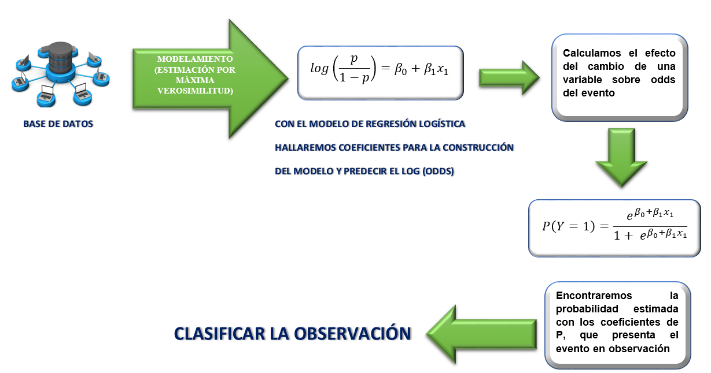

```{r setup, include=FALSE}
knitr::opts_chunk$set(echo = TRUE)
```

<div style="text-align: justify"> 

# 1. INTRODUCCIÓN

La regresión logística se utiliza cuando queremos investigar si una o varias variables explican una variable dependiente que toma un carácter cualitativo. Este hecho es muy frecuente en medicina ya que constantemente se intenta dar respuesta a preguntas formuladas en base a la presencia o ausencia de una determinada característica que no es cuantificable sino que representa la existencia o no de un efecto de interés, como por ejemplo el desarrollo de un evento cardiovascular, un paciente hospitalizado muere o no antes del alta, se produce o no un reingreso, un paciente desarrolla o no nefropatía diabética.

Los modelos de regresión logística aplicados a las ciencias de la salud nos permiten el análisis de los resultados en términos explicativos y predictivos, pudiendo conocer la fuerza de asociación mediante los OR de los factores de riesgo con el efecto estudiado de una manera independiente y conocer el valor predictivo de cada uno de ellos o bien del modelo en su conjunto.

Su utilización en la predicción es el uso más frecuente y extendido, enmarcado en los diferentes tipos de estudios, ya sean típicamente prospectivos con finalidad pronóstica (epidemiología clínica), estudios prospectivos con finalidad analítica (cohortes), estudios caso-control (riesgo atribuible) y en los ensayos clínicos.

**Definición**

Sea Y una variable dependiente binaria que toma dos valores posibles etiquetados como 0 y 1.

Sean $X_1,...,X_k$ un conjunto de variables independientes observadas con el de explicar y/o predecir el valor de $Y$.

El objetivo es determinar $P[Y=1\mid X_1,...,X_k]$

$$P[Y=0\mid X_1,...,X_k]=1-P[Y=1\mid X_1,...,X_k]$$
Se construye un modelo de la forma:

$$P[Y=1\mid X_1,...,X_k]=p(X_1,...,X_k;\beta)$$
donde $p(X_1,...,X_k;\beta)$ es una función que recibe el nombre de función de enlace(función de probabilidad) cuyo valor depende de un vector de parámetros $\beta=(\beta_1,...,\beta_k)$

**Transformación logística**

Si una variable cualitativa con dos niveles se codifica como 1 y 0, matemáticamente es posible ajustar un modelo de regresión lineal por mínimos cuadrados $\beta_{0}+\beta_{1}x$. El problema de esta aproximación es que, al tratarse de una recta, para valores extremos del predictor, se obtienen valores de $Y$ menores que 0 o mayores que 1, lo que entra en contradicción con el hecho de que las probabilidades siempre están dentro del rango $[0,1]$.

En la siguiente figura, observamos que el gráfico **A** la regresión lineal ayuda a predecir una variable numérica, pero no una variable dicotómica. En cambio en el gráfico **B** nos obliga a buscar una alternativa para predecir el evento que sea no lineal.


```{r , echo=FALSE, out.width = '50%'}

```

Entonces esa alternativa es la función logit, que nos permitirá que los valores se encuentren entre $[0,1]$.


```{r , echo=FALSE, out.width = '50%'}

```

Sin embargo, en la función logit el eje $X$ tiene como valores posibles el rango de 0 y 1. Y lo que necesitamos es que esos valores se encuentren en el el eje $Y$, para ello es necesario ocupar la función inversa de logit, denominada función sigmoidal.

$$\text{función sigmoide} = \sigma(x) = \dfrac{1}{1 + e^{-x}} $$

Sustituyendo las $x$ de la función sigmoide por la función lineal $\beta_{1}X_{1}$ se obtiene que:

$$P(Y=k|X = x)= \frac{1}{1+e^{-(\beta_{1}X_{1})}} =$$

$$\frac{1}{\frac{e^{\beta_0+\beta_1X}}{e^{\beta_0+\beta_1X}} + \frac{1}{e^{\beta_0+\beta_1X}}}=$$


$$\frac{1}{\frac{1 + e^{\beta_0+\beta_1X}}{e^{\beta_0+\beta_1X}}}=$$


$$\frac{e^{\beta_0+\beta_1X}}{1+e^{\beta_0+\beta_1X}}$$

Si partimos de nuestra función de probabilidad $p=\frac{e^{\beta_0+\beta_{1}X}}{1+e^{\beta_0+\beta_{1}X}}$, y aplicando logaritmo natural a cada uno de los elementos de la función tendríamos nuestra ecuación final

$$log (\frac{p}{1-p})=\beta_0+\beta_{1}X$$


# 2. CARACTERÍSTICAS

Que hacemos con nuestro modelo de regresión logística entonces:

* **MODELA** la probabilidad de que ocurra un evento partiendo de un conjunto de variables.

* **ESTIMA** la probabilidad de que un evento ocurra para una observación al azar contra la probabilidad de que el evento no ocurra (ODDS).

* **PREDICE** el efecto de una serie de variables en una variable categórica binaria.

* **CLASIFICA** observaciones a través de la estimación de probabilidad de que se encuentre en una categoría determinada.

# 3. PROCESO

```{r , echo=FALSE, out.width = '85%'}

```


# 4. ESTIMACIÓN

Existen dos formas de estimación del modelo logístico según sean las
observaciones disponibles, dicho de otro modo, según el patrón de las covariables (covariate pattern) que no es más que cada combinación de valores de las variables explicativas en el modelo múltiple, o las observaciones de la variable explicativa en el modelo simple.

# 4.1 MÉTODO DE MÁXIMA VEROSIMILITUD

Recordemos que en regresión logística lo que hacemos es predecir la probabilidad ($P(Y)$) de que un evento ($Y$) ocurra para una persona ($i$) dada, basado en las observaciones de si el evento ocurre o no para esa persona (denotamos esto como $Y_i$, el resultado real para la i-ésima persona). Así, para esa i-ésima persona el suceso $Y$ toma los valores 0 (no ocurre) o 1 (ocurre), y el valor predicho, $P(Y)$, variará entre 0 (no hay probabilidad de que el evento ocurra) y 1 (el evento ocurre con seguridad).

$$log-likelihood=-2Ln(Lik(H_0))-2Ln(Lik(H_A))\approx \chi_{k}^{2}$$

El estadístico $log-likelihood$ es análogo a la suma de cuadrados residual en la regresión múltiple en el sentido de que es un indicador cuánta información sin explicar queda en la variable respuesta tras haber ajustado el modelo. Grandes valores del $log-likelihood$ indican un pobre ajuste del modelo, cuanto mayor sea este valor, más variabilidad sin explicar queda en el modelo.

# 4.2 DEVIANZA

Otro indicador importante para estudiar el ajuste del modelo logístico es la devianza que se define como el doble logaritmo del estadístico de verosimilitud, es decir, $devianza=-2\times log-likelihood$ y se representa como $-2LL$

La devianza tiene una distribución $\chi^{2}$ y compara los valores de la predicción con los valores observados en dos momentos:

* El modelo sin variables independientes, sólo con la constante (modelo referencia).
* El modelo con las variables predictoras introducidas.

Simplemente tomamos la devianza del nuevo modelo y le restamos la devianza del modelo referencia. Esta diferencia se lo conoce como $ratio-likelihood$ y tiene una distribución $\chi^{2}$ con $k-1$ grados de libertad, el número de parámetros del nuevo modelo, menos el número de parámetros del modelo referencia que es siempre 1

$$\chi^{2}=2LL(nuevo)-2LL(referencial)$$
$$gl=k_{nuevo}-1$$

Por lo tanto, el valor de la devianza debiera disminuir sensiblemente entre ambas instancias e, idealmente, tender a cero cuando el modelo predice bien.

# 4.3 PSEUDO $R^{2}$

Cuando hablamos de regresión lineal el coeficiente de correlación, $r$ y el de determinación, $R^{2}$, son medidas útiles para saber cómo de bien se ajusta el modelo a los datos. 

Se trata de la correlación parcial entre la variable resultado y cada una de las predictoras, y puede variar entre $-1$ y $1$. Un valor positivo significa que al crecer la variable predictora, lo hace la probabilidad de que el evento ocurra. Un valor negativo implica que si la variable predictora decrece, la probabilidad de que el resultado ocurra disminuye. Si una variable tiene un valor pequeño de $R$ entonces esta contribuye al modelo sólo una pequeña cantidad.

Una medida análoga al $R^{2}$ en la regresión logística puede ser:

$$R_{L}^{2}=\frac{2LL(nuevo)-2LL(referencia)}{2LL(referencia)}$$

es la reducción proporcional en valor absoluto de $log-likelihood$ y mide cuánto del error del ajuste disminuye al incluir las variables predictoras. Proporciona una medición de la significación real del modelo. Esta puede variar entre 0 (indicando que los predictores son inútiles prediciendo la variable respuesta) y 1 (indicando que el modelo predice perfectamente la respuesta).

**$R^{2}$ de Cox y Snell.** (1989) está basado en la devianza de el modelo ($-2LL(nuevo)$) y la devianza del modelo base o referencia ($-2LL(referencia)$), y el tamaño de la muestra $n$ 

$$R_{CS}^{2}=1-exp\left (\frac{(-2LL(nuevo)-(-2LL(referencia))}{n} \right )$$
Sin embargo, este estadístico nunca alcanza su máximo teórico de 1. Por lo tanto, **Nagelkerke** (1991) sugirió la siguiente enmienda:

$$R_{N}^{2}=\frac{R_{CS}^{2}}{1-exp\left (-\frac{-2LL(referencia)}{n} \right )} $$


Aunque todas estas medidas difieren en su cálculo (y las respuestas que obtiene), conceptualmente son algo similares. Entonces, en términos de interpretación, pueden verse como similar al $R^{2}$ en la regresión lineal en que proporcionan un indicador de la significación sustantiva del modelo.


# 4.4 ESTADISTICO WALD

Una vez que se ha finalizado el proceso de máxima verosimilitud, se han encontrado los coeficientes betas, es importante saber si esos $\beta_{i}$ son o no distintos de cero.

* $H_{0}: \beta_{k}=0$

* $H_{1}: \beta_{k}\neq 0$

Teniendo en cuenta el estimador sugerido se puede elaborar un test basado en el valor del coeficiente partido por la desviacion típica elevado al cuadrado, que se ajusta a un $\chi_{1}^{2}$.

$$\left ( \frac{\beta_{i}}{S_{\beta_{i}}} \right )^{2} \approx \chi_{1} ^{2}$$

lo que haremos es que para cada uno de los coeficientes del modelo de regresión logística evaluar el valor del estadístico que estará asociado a un $p-valor$, es decir, si $p<0.05$ rechazaremos la $H_{0}$ y por tanto, ese valor será distinto de cero.

# 4.5 INTERPRETACIÓN DE LOS COEFICIENTES

En las estimaciones de la regresión logística, los coeficientes miden el cambio en el logaritmo de la razón de probabilidad de éxito vs fracaso(conocida como $odds$) cuando $X$ incrementa en una unidad.

Los coeficientes no se interpretan, porque están relacionados con el logaritmo de la razón de odds, se interpreta su exponencial

$$ln(\frac{P}{1-P})=\beta_0+\beta_1X_1$$
$$\frac{P}{1-P}=e^{\beta_{0}+\beta_{1}X_{1}}=e^{\beta_{0}}e^{\beta_{1}X_{1}}$$

Aplicando la función exponencial, esta última expresión puede adoptar esta nueva forma:

$$OR=e^{\beta}$$
Por lo que, el exponencial de $\beta$ no es más que el odds ratio entre dos individuos que se diferencian en una unidad de la variable independiente. Este resultado, tiene un interés especial en el marco de la estimación ya que, si $X$ representa un factor que puede estar o no presente.

* El hecho de que $\beta=0$ equivale a que $OR=1$, es decir, que la variable independiente en cuestión no esta asociada a la probabilidad de enfermar.

* Si tenemos un $OR>1$ significa que por cada incremento en una unidad de la variable $X$, podemos apostar $OR$ a 1 que la variable $p(Y=1)$ le ocurriria dicho evento. 

* Si el $OR<1$, se recomienda aplicar la inversa, para efectos de interpretación, es decir $\frac{1}{OR}$. 

## 4.5.1 Caso de una única variable cualitativa

Sea $p$ la probabilidad de fallecer en enfermos que sufren determinada
enfermedad. Se desea estudiar como influye sobre $p$ el tratamiento aplicado, comparándose tres tratamientos alternativos A, B y C.

Se definen dos variables "dummy" de la siguiente forma:

* $X_1$ vale 1 si se aplica el tratamiento B y vale 0 en caso contrario.
* $X_2$ vale 1 si se aplica el tratamiento C y vale 0 en caso contrario.

Por lo tanto, el modelo de regresión logística sería:

$$log \frac{P}{1-P}=\beta_{0}+\beta_{1}X_{1}+\beta_{2}X_{2}$$

$$\frac{P}{1-P}=e^{\beta_{0}+\beta_{1}X_{1}+\beta_{2}X_{2}}=e^{\beta_{0}}e^{\beta_{1}X_{1}}e^{\beta_{2}X_{2}}$$

y definiendo el riesgo de fallecimiento por el odd $\frac{P}{1-P}$ se tiene:

* Riesgo de fallecimiento con el tratamiento A ($x_{1}=0$, $x_{2}=0$): $e^{\beta_{0}}$.

* Riesgo de fallecimiento con el tratamiento B ($x_{1}=1$, $x_{2}=0$): $e^{\beta_{0}}e^{\beta_{1}}$

* Riesgo de fallecimiento con el tratamiento C ($x_{1}=0$, $x_{2}=1$):
$e^{\beta_{0}}e^{\beta_{2}}$

Por lo tanto:

$e^{\beta_{1}}$: es el valor por el que se multiplica el riesgo si se utiliza el tratamiento B en vez del tratamiento A.

$e^{\beta_{2}}$: es el valor por el que se multiplica el riesgo si se utiliza el tratamiento C en vez del tratamiento A.

## 4.5.2 Caso de una única variable cuantitativa

Sea $p$ la probabilidad de fallecer a causa de un determinado tumor
cancerígeno en mama. Se desea estudiar cómo influye sobre $p$ el tamaño $X$
del tumor (medido en cms en el momento de la masectomía).

En este caso $X$ puede introducirse directamente en la ecuación

$$log \frac{P}{1-P}=\beta_{0}+\beta_{1}X=e^{\beta_{0}+\beta_{1}X}$$

El aumento de 1 cm del tamaño del tumor hace que el riesgo pase de:

$$e^{\beta_{0}+\beta_{1}X} \rightarrow e^{\beta_{0}+\beta_{1}(X+1)}=e^{\beta_{0}+\beta_{1}X}e^{\beta_1} $$

Por lo tanto, $e^{\beta_{1}}$ cuantifica por cuanto se multiplica el riesgo por cada cm de aumento en el tamaño del tumor, o sea es el ratio (o.r.) entre los OD después y antes de aumentar una unidad x1.

## 4.5.3 Interacción y confusión

La interacción y confusión son dos temáticas importantes cuando utilizamos modelos de regresión con el objetivo de predecir.

Entonces:

* Existirá **confusión** cuando la asociación entre dos variables difiere significativamente según que se considere, o no, otra variable, y a esta última variable es a lo que conocemos como variable de confusión.

* La **interacción** es la condición que produce que la relación de interés entre dos variables o factores sea diferente para distintos niveles de un tercer factor.

La solución para estas temáticas radica en el análisis estratificado que es el que permitirá la evaluación y control del efecto de confusión y, por otra parte, permite evaluar y describir el de interacción.

El procedimiento que debe llevar a cabo es que primero debemos ver si hay interacción entre las variables, en caso de que no exista, y después la confusión.

Por que el caso de que no exista, es por el hecho de que si existiese entonces se están haciendo todas las combinaciones posibles donde se relacionan las variables $x_{1}$ y $x_{2}$, entonces ya esta involucrado la ingerencia al hacer las combinaciones de las diferentes categorías de las variables, entonces en caso de que no exista, ya se puede sondear la confusión, esto no es siempre cierto porque dependerá del objetivo de la investigación.

## 4.5.4 Multicolinealidad

Se dice que existe multicolinealidad cuando dos o más de las covariables del modelo mantienen una relación lineal. Cuando la colinealidad es perfecta, es decir, cuando una covariable puede determinarse según una ecuación lineal de una o más de las restantes covariables, es imposible estimar un único coeficiente de todas las covariables implicadas. En estos casos debe eliminarse la covariable que actúa como dependiente.

Normalmente lo que se hallará será una multicolinealidad moderada, es decir, una mínima correlación entre covariables. Si esta correlación fuera de mayor importancia, su efecto sería el incremento exagerado de los errores estándar, y en ocasiones, del valor estimado para los coeficientes de regresión, lo que hace las estimaciones poco creíbles. Podemos verificar este supuesto con los estadísticos de VIF y tolerancia, en las matrices de correlación, etc.


# 4.6 PREDICCIONES

Una vez estimados los coeficientes del modelo logístico, es posible conocer la probabilidad de que la variable dependiente pertenezca al nivel de referencia, dado un determinado valor del predictor. Para ello se emplea la ecuación del modelo:

$$\hat{p}(Y=1|X)=\frac{e^{\hat{\beta_0}+\hat{\beta_1}X}}{1+e^{\hat{\beta_0}+\hat{\beta_1}X}}$$

# 4.7 CONVERTIR LA PROBABILIDAD EN CLASIFICACIÓN

Una de las principales aplicaciones de un modelo de regresión logística es clasificar la variable cualitativa en función de valor que tome el predictor. Para conseguir esta clasificación, es necesario establecer un $threshold$ de probabilidad a partir de la cual se considera que la variable pertenece a uno de los niveles. Por ejemplo, se puede asignar una observación al grupo 1 si $\hat{p}(Y=1|X)>0.5$ y al grupo 0 si de lo contrario.


# 5. REGRESIÓN LOGÍSTICA BINARIA SIMPLE

El modelo logístico para el caso de una sola variable independiente toma la forma siguiente:

$$ln(\frac{P}{1-P})=\beta_0+\beta_1X_1$$
donde $P$ representa la probabilidad de que un individuo exhiba o desarrolle la característica de interés y $X$ es la única variable independiente. La expresión anterior es equivalente a la siguiente:

$$\frac{P}{1-P}=exp(\beta_0+\beta_1X_1)$$
Si se considera el caso en que la variable $X$ es cuantitativa y se representan los valores de $P$ en función de los valores de $X$ en un sistema de ejes cartesianos, se podrá comprobar que la expresión gráfica del modelo cuando $\beta$ es positivo.


```{r, fig.align="center",echo=FALSE}
p <- seq(0,1,l=1000)
logitp <- log(p/(1-p))
plot(logitp,p,t='l',xlab="log(p/1-p)")
abline(h=c(0,0.5,1),v=0,col="grey")
points(0,0.5,pch=19,col="red")
```

Ahora bien, si la variable es cualitativa entonces se le conoce con el nombre de factor de riesgo en el mundo de la medicina, donde la variable $Y$ indica habitualmente la presencia de una determinada enfermedad, objeto de estudio y en ausencia toma el valor de 0, tal como lo demuestra la siguiente fórmula:

$$\frac{p[Y=1\mid X_1,...,X_K]}{p[Y=0\mid X_1,...,X_K]}=\frac{p[x_1,...,x_K;\beta]}{1-p(x_1,...,x_K;\beta)}$$

**Ejemplo**

Se lleva a cabo un estudio de dos cohortes de individuos, una de 470 hombres con unos niveles de 240mgrs. de colesterol y otra de 254 con 210 mgrs. de colesterol; tras el período de seguimiento, en la primer cohorte hubo 31 casos de enfermedad coronaria y 8 en la segunda.

```{r,echo=FALSE,warning=FALSE}
library(readxl)
coronaria <- read_excel("C:/Users/UNICA/Desktop/RL/Logistic-Regression-in-Health/coronaria.xlsx")
attach(coronaria)
head(coronaria)
```

```{r}
modelo <- glm(ENF_CORONARIA ~ `NIVEL COLESTEROL`, data = coronaria, family = "binomial")
summary(modelo)
```

Las estimaciones de los parámetros para nuestro ejemplo fue de: $\hat{\beta_{0}}=-3.42$ y $\hat{\beta_{1}}=0.77$.

El intervalo de confianza de $\beta_{1}$ es:

```{r}
confint(modelo, level = 0.95 )
```

Suponiendo que se cumple el modelo de regresión logística, estamos interesados en determinar si la variable "colesterol" es significativa para explicar "enfermedad coronaria". Planteamos entonces el siguiente contraste:

* $H_{0}:\beta_{1}=0$ (la variable "colesterol" no es significativa) 

* $H_{1}:\beta_{1} \neq 0$ (la variable "colesterol" es significativa) 

El estadístico de Wald se obtiene dividiendo el $\hat{\beta_{1}}$ entre su error típico $\sigma(\hat{\beta_{1}})$.

$$W=\frac{\hat{\beta_{1}}}{\sigma(\hat{\beta_{1}})}$$

Independientemente del valor arrojado por W y dado tambien que el $p-value=0.05$ esta al límite, consideraremos dicha variable, porque según la literatura el "colesterol" es factor importante en el desarrollo o no de la enfermedad coronaria.

Siempre que se construye un modelo de regresión debemos corroborar que el modelo calculado se ajusta efectivamente a los datos usados para estimarlo.
En regresión logística se calculan coeficientes de determinación, parecidos al coeficiente $R^{2}$ que se obtenía en regresión lineal, que expresan la proporción (en tanto por uno) de la variación explicada por el modelo.

```{r}
library(ResourceSelection)
hoslem.test(coronaria$ENF_CORONARIA,fitted(modelo))
```

La prueba de Hosmer Lemeshow lo que nos va a permitir es, decir, que el modelo es bueno, y para ello debemos ver que el $p-value>0.05$, que para nuestro ejemplo cumple ese criterio.

Ahora bien, también nos podemos apoyar en otros estadísticos para ver si el modelo es bueno como el $R^{2}$ de Cox y Snell o $R^{2}$ de Nagelkerke

```{r}
R.cs=1-exp((modelo$deviance-modelo$null.deviance)/724)
R.cs

```

```{r}
R.n=R.cs/(1-(exp(-(modelo$null.deviance/724))))
R.n
```

En este ejemplo, el $1.7\%$ (R Nagelkerke x 100) de la variable dependiente (en este caso la enfermedad coronaria) es explicada por la variable incluidas en el modelo (colesterol). Esto indica que solo un $1.7\%$ de la enfermedad coronaria es explicada por la variable colesterol, es decir que hay un $98.3\%$ que no está explicado por la variable colesterol.

Puede ser que incluyendo más variables al modelo dicho valor de $R^{2}$ mejore.

El odds ratio lo calculamos de la siguiente manera:

```{r}
exp(modelo$coefficients)
```

En este ejemplo, podemos decir que la probabilidad de que un paciente que presento un nivel de colesterol alto tiene 2.17 veces más la posibilidad de desarrollar una enfermedad coronaria en comparación aquellos pacientes que no tuvieron un nivel de colesterol bajo.

Podemos además calcular los intervalos de confianza de los coeficientes

```{r}
exp(confint(modelo))
```

El hecho de que tanto los límites inferiores y superiores de nuestro intervalo de confianza estén por encima de 1 nos da la confianza de que la dirección de la relación que hemos observado es cierta en la población.


```{r}
library(vcd)
predice <- ifelse(test = modelo$fitted.values > 0.5, yes = 1, no = 0)
clasificacion <- table(modelo$model$ENF_CORONARIA, predice, dnn = c("observaciones", "predicciones"))
clasificacion
```

De esta tabla podemos tomar una medida que nos indica la tasa de mala clasificación de nuestro modelo.

```{r}
tmc=1-sum(coronaria$ENF_CORONARIA==predice)/724
tmc*100
```

Es decir, de todos los clasificados, el $5.4\%$ de los datos han sido mal clasificados.

$\frac{685+0}{685+0+39+0}=0.946(94.6\%)$, esto quiere decir que el $94.6\%$ de los datos están bien clasificados.

Al hacer el ajuste de regresión logística podemos pedirle a R que nos devuelva los valores pronosticados.

```{r}
coronaria$probabilidades.predichas <- fitted(modelo)
head(coronaria[, c("NIVEL COLESTEROL", "probabilidades.predichas")])
```

Estos valores nos dicen que cuando un paciente tiene un nivel de colesterol alto (240mgrs), hay una probabilidad de 0.066($6.6\%$), de que presente enfermedad coronaria. Sin embargo, si el paciente tiene niveles de colesterol bajo (210mgrs), hay una probabilidad de 0.032($3.2\%$) de que mejoren las personas de no desarrollar enfermedad coronaria.

# 6. REGRESIÓN LOGÍSTICA BINARIA MÚLTIPLE

Anteriormente, se discutió el modelo logístico binario simple, donde sólo se opera con una variable independiente. Pero éste puede ser extendido, naturalmente, incorporando más variables independiente (continuas o categóricas). Esto nos permitirá, a entender mejor por que varía la respuesta entre un individuo y otro.

Consideremos entonces la variable dicotómica $Y$ (toma valores 0 o 1 dependiendo de la condición que presente el estudio) y un conjunto de variables independientes $x_{1},x_{2},\ldots,x_{k}$ con probabilidad $P(Y=1|x)$.

El modelo logístico múltiple es:

$$log\left ( \frac{p_{i}}{1-p_{i}} \right )= \beta_{0}+\beta_{1}x_{1}+\beta_{2}x_{2}+ \cdots + \beta_{k}x_{k}$$

o también

$$p_{i}= \frac{e^{\beta_{0}+\beta_{1}x_{1}+\beta_{2}x_{2} + \cdots + \beta_{k}x_{k}}}{1+e^{\beta_{0}+\beta_{1}x_{1}+\beta_{2}x_{2}+ \cdots + \beta_{k}x_{k}}}$$

# 6.1 ESTIMACIÓN DE PARÁMETROS

La estimación de los parámetros $\hat{\beta_{0}},\hat{\beta_{1}},\cdots , \hat{\beta_{k}}$ de un modelo de regresión logística se
efectúa por medio del método de estimación por máxima verosimilitud. 

El fundamento de dicho método radica en tomar como estimadores de los
parámetros desconocidos aquellos valores que hacen máxima la
verosimilitud de la muestra, o sea la probabilidad de haber observado
precisamente los datos que se han obtenido.


Para ello partimos de un modelo de Bernoulli donde $Y$ solo puede tomar valores de (0,1).

$$P(Y=1 \mid X)=p$$

$$P(Y=0 \mid X)=1-p$$

Calculamos su función de verosimilitud bajo el supuesto de independencia

$$P(Y=y_{1},\cdots,Y=y_{n})=\prod_{i=1}^{n}p_{i}^{y_{i}}(1-p_{i})^{1-y_{i}}$$

Aplicando $Ln$ para simplificar

$$Ln(P(Y))=\sum_{i=1}^{n}y_{i}Ln\left ( \frac{P_{i}}{1-P_{i}} \right )+\sum_{i=1}^{n}Ln(1-P_{i})$$

Expresaremos las probabilidades $p_{i}$ como una función de las $X´s$

$$p=P(Y=1 \mid X)=G(\beta_{0}+\beta_{1}x_{1}+\cdots+\beta_{k}x_{k})$$

Para el caso del modelo logit

$$G(\beta_{0}+\beta_{1}x_{1}+\cdots+\beta_{k}x_{k})=\frac{e^{\beta_{0}+\beta_{1}x_{1}+\beta_{2}x_{2} + \cdots + \beta_{k}x_{k}}}{1+e^{\beta_{0}+\beta_{1}x_{1}+\beta_{2}x_{2}+ \cdots + \beta_{k}x_{k}}}$$

Al introducir la función $G$ en el $Ln$ tenemos:

$$Ln(P(Y))=\sum_{i=1}^{n}y_{i}(\beta_{0}+\beta_{1}x_{1}+\cdots+\beta_{k}x_{k})-\sum_{i=1}^{n}Ln(1+e^{\beta_{0}+\beta_{1}x_{1}+\cdots+\beta_{k}x_{k}})$$

derivando respecto a los $k+1$ parámetros e igualando a cero cada una de las $k+1$ derivadas obtendremos un sistema de ecuaciones, evidentemente más complejo que en el caso de una sola predictora, que se tiene que resolver por procedimientos iteractivos.

$$\frac{\partial}{\partial{\beta_{i}}}=\left ( \sum_{i=1}^{n}y_{i}(\beta_{0}+\beta_{1}x_{1}+\cdots+\beta_{k}x_{k})-\sum_{i=1}^{n}Ln(1+e^{\beta_{0}+\beta_{1}x_{1}+\cdots+\beta_{k}x_{k}}) \right )=0$$

El resultado es un sistema de ecuaciones altamente no lineal que debe maximizarse por métodos numéricos. Para encontrar los verdaderos valores se suele utilizar el algoritmo de Newton-Raphson (https://estadistica-dma.ulpgc.es/FCC/05-3-Raices-de-Ecuaciones-2.html).

Como resultado de este procedimiento de inferencia tenemos dos resultados:

* Los coeficientes $\beta_{i}$, que son los estimadores máximo verosímiles.

* El logaritmo de la verosimilitud (Log Lik), este jugará un papel muy importante a la hora de ver si el modelo es significativo o no.


**Ejemplo**

La siguiente base de datos fue retomada de una tesis denominada: **"Análisis estadístico de los factores de riesgo que influyen en la enfermedad Angina de pecho"**, el cual sus datos fueron obtenidos en el servicio de Cardiología del Policlínico Juan José Rodríguez, en Perú, en el cuarto trimestre del año 2001, el cual trata de estudiar la ocurrencia o no ocurrencia de la enfermedad Angina de pecho en un grupo de 149 pacientes, de los cuales 68 tiene la enfermedad y 78 no la presentan.

La variables observadas son:

* **Angina**: 0 si no la presenta, 1 si la presenta.

* **Edad**: edad en años cumplidos del paciente.

* **Sexo**: 0 femenino, 1 masculino.

* **Colesterol**: valor normal 140-200 mg/dl.

* **Triglicéridos**: valor normal 45-150 mg/dl.

* **Glucosa**: valor normal 70-110 mg/dl.

* **HTA**: 0 no presenta, 1 si presenta.

* **Obesidad** : 0 no tiene, 1 si tiene.

```{r}
library(readxl)
angina <- read_excel("C:/Users/UNICA/Desktop/RL/Logistic-Regression-in-Health/angina.xlsx")
head(angina)
```

La angina de pecho es la manifestación clínica de dolor u opresión en el pecho. La causa es el déficit de riego sanguíneo en las arterias coronarias, en la mayoría de los casos causados por una placa de colesterol. Es por ello, que queremos saber si con los datos recolectados el colesterol es un factor de riesgo para los pacientes que presentaron la complicación de angina de pecho.

Continuando con la misma base pero ahora utilizaremos todas la variables, para poder desarrollar el modelo de regresión logística múltiple.

```{r}
rlm <- glm(angina ~ edad+sexo+colesterol+trigliceridos+hipertension+glucosa+obesidad,data = angina, family = binomial())
summary(rlm)
```

Como observamos en la salida las únicas variables que resultaron estadísticamente significativas son: edad, colesterol, triglicéridos e hipertensión, por lo tanto, construiremos otro modelo.

```{r}
rlm1<-glm(angina ~ edad+colesterol+trigliceridos+hipertension,data=angina,family=binomial())
summary(rlm1)
```

En este caso la devianza del modelo nulo es -2LL=205.42, pero cuando añadimos todas las demás variables este valor se reduce a 99.55, lo que nos dice que con esta variable el modelo mejora prediciendo si alguien presenta Angina.

También, podemos observar que el valor de AIC inicial que fue de 114.8 a 109.55 por lo que es un buen modemo para predecir.

```{r}
dev <- rlm1$deviance
nullDev <- rlm1$null.deviance
modelChi <- nullDev - dev
modelChi
```

Como podemos ver 99.55 no es mayor que 105.87, por lo tanto no se rechaza la hipótesis nula; entonces, el modelo se ajusta perfectamente, es decir, las 4 variables explicativas del modelo son diferentes de cero excepto la constante.

```{r}
chigl <- rlm1$df.null - rlm1$df.residual
chisq.prob <- 1 - pchisq(modelChi, chigl)
chisq.prob
```

Para evaluar el modelo, se puede comparar el valor real (si realmente es Angina) con el predicho por el modelo.

```{r}
library(vcd)
predicciones <- ifelse(test = rlm1$fitted.values > 0.5, yes = 1, no = 0)
matriz_confusion <- table(rlm1$model$angina, predicciones, dnn = c("observaciones", "predicciones"))
matriz_confusion
```

Dicha tabla lo que nos quiere decir es que, el modelo es capaz de clasificar correctamente $\frac{70 + 55}{70+11+13+55} = 0.8389 (84\%)$ de las observaciones cuando ocurre la Angina de pecho.

El modelo quedaría construido de la siguiente manera:


$$Y=-14.77+0.087EDAD+0.0344COLESTEROL+0.013TRIGLICERIDOS+2.396HTA$$

Procederemos a calcular el OR del modelo:

```{r}
options(scipen = 999) #Para evitar que mis datos me salgan en notación
#científica
exp(cbind(OR=coef(rlm1),confint(rlm1)))
```

Por lo tanto, las variables Edad, HTA, colesterol y triglicéridos son factores para que incrementan la probabilidad de ocurrencia de la enfermedad de Angina de pecho. 

Para interpretarlo mejor, un incremento en una unidad en la Edad del paciente provocaría, 1.09 veces más la probabilidad de ocurrencia de la enfermedad, en cambio, para los HTA, decimos que, la probabilidad de que un paciente con HTA tiene 10.9 veces más la posibilidad de desarrollar Angina en comparación aquellos pacientes que no tienen HTA.

## 7. MÉTODOS PASO A PASO

Si usamos el método **hacia delante** el ordenador empieza con un modelo que incluye solo la constante y entonces añade predictores individuales al modelo basándose en la variable que mejore el **AIC** o **BIC**. El ordenador continua mientras ninguno de los predictores restantes haya disminuido el criterio.

El método **hacia atrás** usa el mismo criterio pero empieza el modelo incluyendo todas las variables predictoras. R comprueba si alguno de esos predictores puede ser retirado del modelo sin incrementar el criterio de información (AIC). Si se puede, esa variable se saca del modelo, y se analizan de nuevo el resto de variables.

Mejor que estos métodos es el de **ambas direcciones** que empieza como el método hacia delante, con solo la constante, pero cada vez que añadimos una variable, el ordenador comprueba si merece la pena eliminarla.

Para efectos prácticos utilizaremos el método de **hacia atrás(backward)**.

```{r}
step(rlm, direction = "backward")
```

Comenzamos con un AIC=114.8 y la función considera la eliminación de cada una de las variables para finalmente sacar del modelo la variable obesidad, glucosa y sexo, van paso a paso por ser las que producen un AIC alto. Luego de hacer el proceso con cada una de las variables eliminadas logramos tener un mejor AIC=109.6 con las variables triglicéridos, colesterol, HTA y edad.

Vamos a estudiar este supuesto en nuestro modelo final ya sabemos que algunas variables no aportaban nada al modelo.

```{r}
library(car)
vif(rlm1)
```

Estos valores indican que no hay problema de colinealidad, dado que un VIF más de 10 se considera problemático, por lo tanto, el resultado de este análisis es bueno en ese sentido.

En todo caso si existiese multicolinealidad debemos de hacer lo siguiente:

* Podemos intentar eliminar la variable menos necesaria implicada en la colinealidad, a riesgo de obtener un modelo menos válido. Sin embargo, un problema común es no saber qué variable debemos omitir. Cualquiera de las variables problemáticas puede ser omitida, no hay fundamentos estadísticos para suprimir una variable en vez de otra.

* Se recomienda que si eliminamos una variable predictora, ésta se reemplace por otra igualmente importante que no tenga una colinealidad tan fuerte.

* Se puede intentar cambiar la escala de medida de la variable en conflicto (es decir, transformarla). Sin embargo estas transformaciones hacen al modelo muy dependiente de los datos actuales, invalidando su capacidad predictiva.

* También se puede recurrir a aumentar la muestra para así aumentar la información en el modelo y ver si la multicolinealidad puede disminuir, aunque no siempre será posible.

* La última posibilidad, aunque más compleja cuando hay varios predictores, es hacer un análisis factorial y usar las puntuaciones del factor resultante como predictor.

</div>

